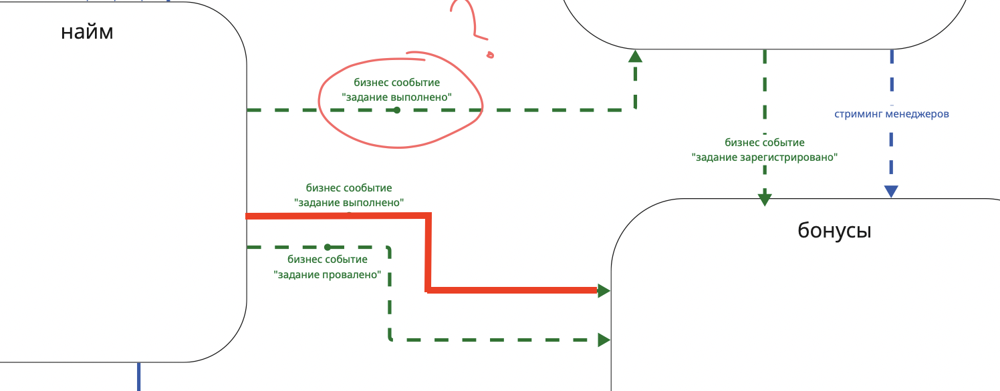

# Homework 4
## Task 1. ADR

**ADR 1**: Исправляем ошибки из-за сервиса бонусов при правильном выполнении задания кандидатом.

**Status.** 

Proposed.

**Context.**

На момент принятия решения бизнес планировал отправлять запрос на начисление баллов сразу при правильном выполнении задания кандидатом, с помощью запроса в сервис бонусов. Вот так выглядит этот процесс со стороны бизнес-процесса:

Это был более простой вариант реализации и логика была следующей: ученик выполняет задание правильно, система делает синхронный HTTP-запрос в сервис бонусов, чтобы начислить менеджеру баллы. Но с такой реализацией возник ряд проблем:

- [Problem-040] Медленно начисляются бонусы менеджерам, потому что много кандидатов в учителя. Иногда вся система падает и не восстанавливается.
- [Problem-050] В UI может отобразиться ошибка каких-то запросов после успешного выполнения задания. Разработчики объясняют это поведение вызовом сервиса оплаты и создания заданий.
- [Problem-070] Менеджерам иногда начисляются бонусы дважды. Это связано с тем, что, когда кандидаты в учителя отправляют то же самое задание повторно, система тупит [Problem-050]. Разработчики объясняют тем, что управление заданиями падает, а бонусами — нет. Из-за этого бонусы попадают в два одинаковых запроса.
- [Problem-080] Упавший сервис создания заданий или бонусов кладёт всю систему, и кандидаты в учителя не могут выполнять задания.

Если посмотреть на данные проблемы, то их всех объединяет одна общая причина: проблема с запросом в сервис бонусов. Синхронный запрос при фейле ломает весь флоу, который ожидается при правильном выполнении задания кандидатом. Что еще хуже, помимо каких-то ошибок в UI возможны ситуации где система начисляет двойной бонус или вообще падает.

**Decision.**

Способ, который позволит избавиться от такой проблемы даже в случае недоступности системы бонусов (но при этом не потерять бонусы за задания) - переход в этом месте с синхронной связи на асинхронную event-driven связь. Данный переход позволит повысить reliability всей системы, убрав одну из зависимостей работоспособности сервиса найма от сервиса бонусов. Это не только избавит от ошибок но и гарантирует, что бонусы не будут потеряны из-за ошибки, даже если сервис бонусов лежит. Эвенты будут обработаны сервисом бонусов как только это будет возможно и бонусы будут начислены менеджерам.

Так как в проекте уже используется Kafka, то в качестве брокера сообщений мы так же будем использовать ее, заведя еще один топик для нового типа ивентов, который будет поставляться сервисом найма при верно выполненном задании.

