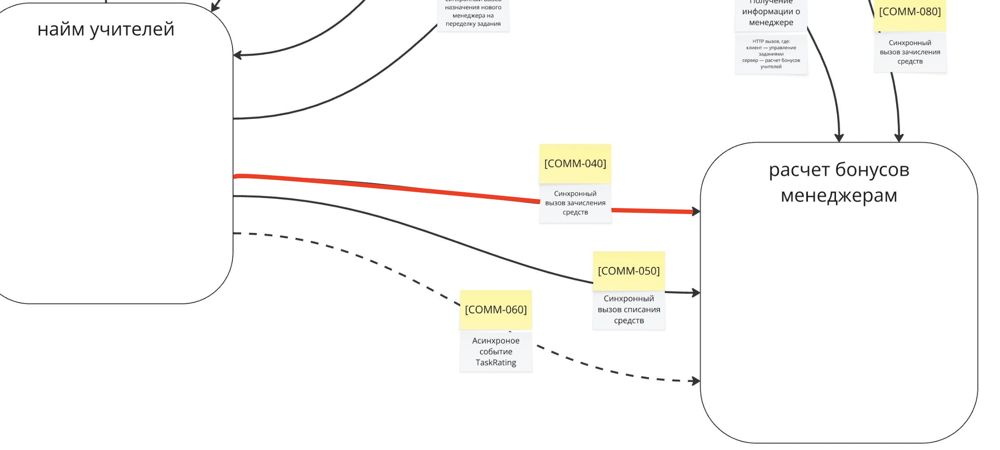

# Homework 4
## Task 1. ADR

ADR 1: Исправляем ошибки из-за сервиса бонусов при правильном выполнении задания кандидатом.

Status. Proposed.

Context. 
На момент принятия решения бизнес планировал отправлять запрос на начисление баллов сразу при правильном выполнении задания кандидатом, с помощью запроса в сервис бонусов. Вот так выглядит этот процесс со стороны бизнес-процесса:

Это был более простой вариант реализации и логика была следующей: ученик выполняет задание правильно, система делает синхронный HTTP-запрос в сервис бонусов, чтобы начислить менеджеру баллы. Но с такой реализацией возник ряд проблем:

- [Problem-040] Медленно начисляются бонусы менеджерам, потому что много кандидатов в учителя. Иногда вся система падает и не восстанавливается.
- [Problem-050] В UI может отобразиться ошибка каких-то запросов после успешного выполнения задания. Разработчики объясняют это поведение вызовом сервиса оплаты и создания заданий.
- [Problem-070] Менеджерам иногда начисляются бонусы дважды. Это связано с тем, что, когда кандидаты в учителя отправляют то же самое задание повторно, система тупит [Problem-050]. Разработчики объясняют тем, что управление заданиями падает, а бонусами — нет. Из-за этого бонусы попадают в два одинаковых запроса.
- [Problem-080] Упавший сервис создания заданий или бонусов кладёт всю систему, и кандидаты в учителя не могут выполнять задания.

При этом, чтобы бизнес-логика работала, необходимы ещё два набора сущностей, которые были определены в system form: студенты и домашка под урок. Обе сущности уже заранее передаются в сервис с домашками с помощью асинхронной event-driven-коммуникации.
Два набора сущностей, которые необходимы в сервисе домашек и передаются из других частей системы. 
Два набора сущностей, которые необходимы в сервисе домашек и передаются из других частей системы. Посмотреть поближе
На момент принятия решения в момент, когда ученик отмечал урок прочитанным, сервис предоставления уроков отправлял асинхронное событие ChangeLessonStatus. К сожалению, у бизнеса возникли проблемы с такой реализацией коммуникации, которые выглядели так:
Данные обновляются с задержкой. Студенты делают домашку сразу после урока, но преподаватели видят её только через несколько минут или часов.
   
Данная проблема возникала из-за eventual consistency, который возник из-за использования асинхронной коммуникации. Чтобы решить проблему, нужно добиться strong consistency в этом месте.
Decision.
Единственный способ решить проблему перехода с eventual consistency на strong consistency — перевести связь с асинхронной на синхронную. Так как синхронная связь может быть только request-response, то остаётся выбрать способ имплементации в коде.
В нашем проекте не используется RPC для коммуникации между сервисами, по дефолту — http-вызовы. Следовательно, асинхронное событие ChangeLessonStatus будет заменено на синхронный http-вызов.
